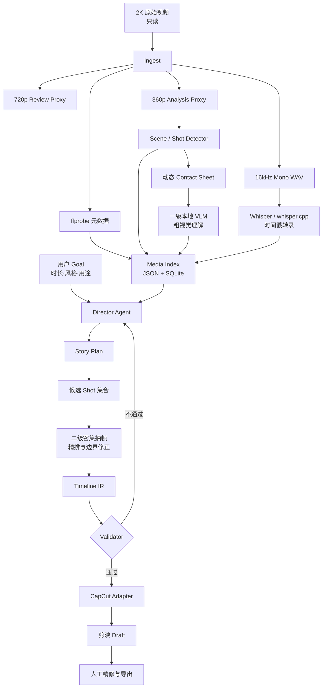
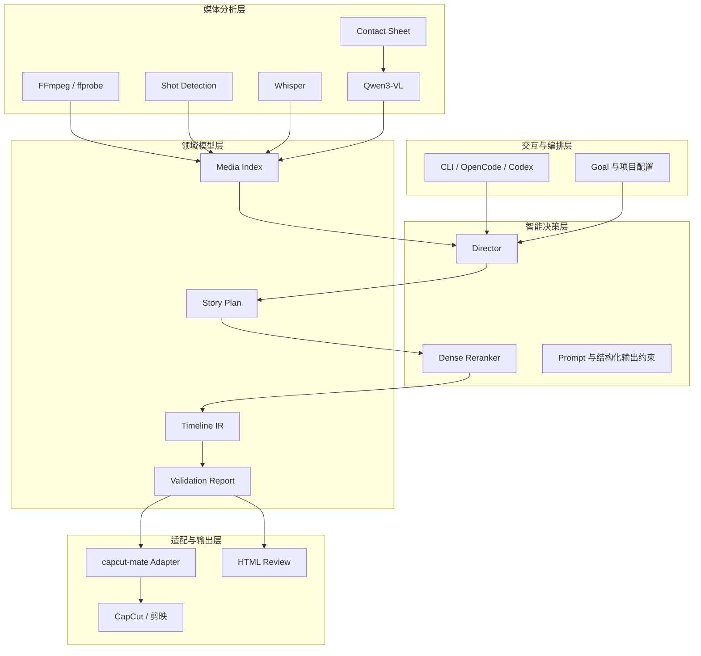
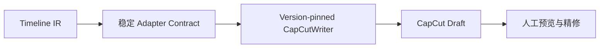
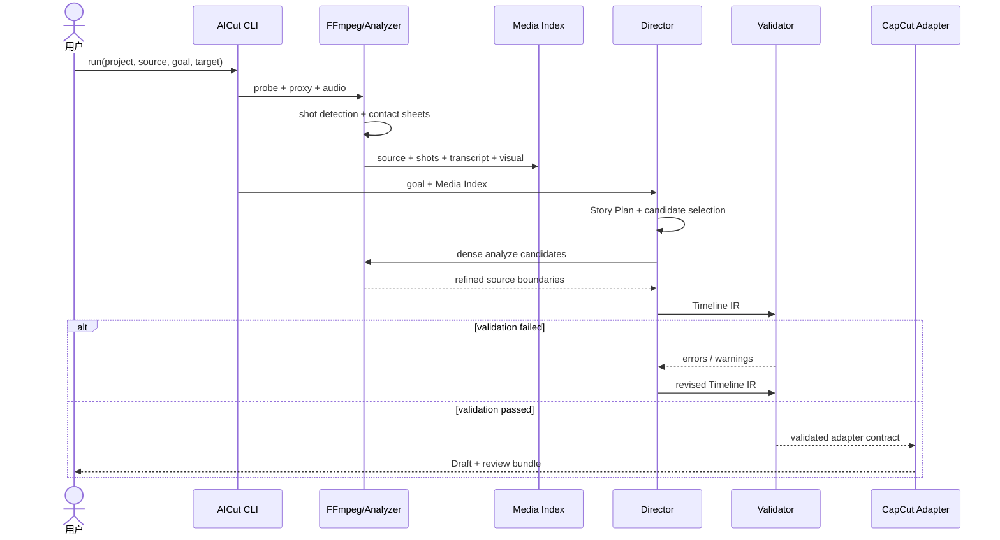
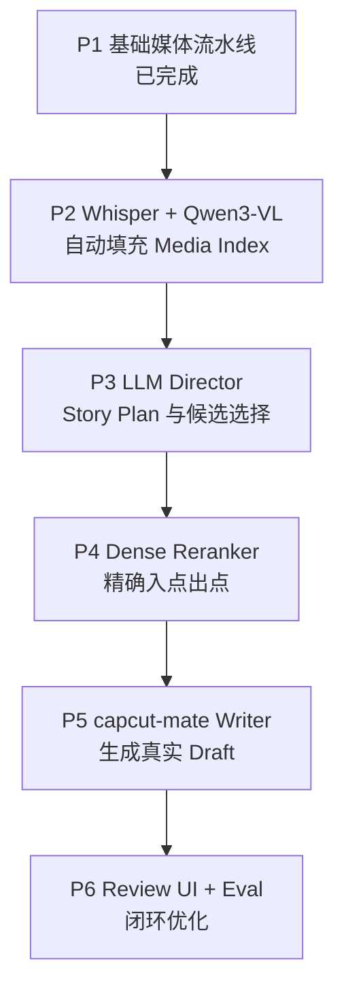

# AICut 完整架构与实现说明

版本：0.1 PoC  
目标平台：macOS（M1 Air 优先）、Linux  
核心原则：原片只读、先索引后导演、两阶段视觉分析、稳定中间表示、程序化验证、剪映完成人工精修与导出。

---

## 1. 建设目标

AICut 面向约 30 分钟、2K 分辨率的普通视频素材，把“理解原片、组织故事、选择镜头、生成时间线、导入剪映”拆成可独立验证的流水线。系统不让大模型直接读取整段原片，也不让 Director LLM 直接操作剪映内部草稿，而是通过两个稳定数据边界完成解耦：

1. **Media Index**：原片内容的结构化证据层。
2. **Timeline IR**：与具体非编软件无关的剪辑决策层。

系统目标不是完全替代剪辑师，而是让 AI 完成约 80%–90% 的素材整理和初剪，人工完成最后 10%–20% 的节奏、审美、音乐、字幕和精修。

## 2. 总体架构图



## 3. 分层架构



各层只通过文件契约交互。外部模型、FFmpeg 或剪映版本变化时，只替换对应适配器，不改变 Media Index 和 Timeline IR 的语义。

## 4. 完整处理流程

### 4.1 阶段一：素材接入

1. 用户创建项目目录并提供原始视频绝对路径。
2. `ffprobe` 读取时长、分辨率、帧率和编码。
3. 读取原片头部 1 MiB 计算哈希，用于检测素材是否被替换，避免把长视频整体载入内存。
4. 项目文件记录 `source_immutable=true`；后续处理只读取原片。
5. FFmpeg 生成：
   - `proxy-720p.mp4`：人工快速预览和候选精查。
   - `proxy-360p.mp4`：场景检测和一级视觉分析。
   - `speech-16k.wav`：单声道语音识别输入。

### 4.2 阶段二：Shot 切分

当前 PoC 使用 FFmpeg `scene` 分数检测转场：

```text
select='gt(scene,0.32)',showinfo
```

处理规则：

- 忽略距离视频首尾小于 0.25 秒的伪切点。
- Shot 最短保留时长为 0.15 秒。
- 单个 Shot 超过 20 秒时强制分段，避免 Contact Sheet 信息密度不足。
- Shot ID 使用稳定顺序编号：`shot-00001`。
- 生产版可将检测器替换为 PySceneDetect，但输出仍保持相同 Shot 契约。

### 4.3 阶段三：动态 Contact Sheet

每个 Shot 只生成一张概览图，一级 VLM 不逐帧读取视频。抽帧数量按 Shot 时长动态变化：

| Shot 时长 | 抽帧数 |
| --- | ---: |
| `< 1.5s` | 1 |
| `1.5s–4s` | 3 |
| `4s–8s` | 4 |
| `8s–15s` | 6 |
| `≥ 15s` | 9 |

抽样点位于各时间分区中点，避免抽到切镜边缘。帧宽统一为 320 像素，以最多三列拼接；每帧写入源时间戳。Contact Sheet 只用于粗理解，不负责精确入点和出点。

### 4.4 阶段四：语音与视觉理解

语音和视觉是两条独立管线：

- **Whisper / whisper.cpp**：输出 segment 和 word 级源时间戳。
- **本地 Qwen3-VL**：读取 Contact Sheet，输出内容摘要、人物、动作、地点、画面质量、情绪和标签。

独立处理的原因：

- ASR 对连续音频的识别能力明显优于视觉模型“看字幕猜语音”。
- VLM 不必承担精确语音时间轴，减少上下文和推理成本。
- 任一模型失败时，Media Index 仍可用另一模态继续构建。

### 4.5 阶段五：构建 Media Index

Media Index 将源信息、Shot、视觉描述、Transcript、质量分和标签合并为统一证据库：

```json
{
  "schema_version": "1.0",
  "source": {
    "path": "/videos/source.mp4",
    "duration": 1800.2,
    "width": 2560,
    "height": 1440
  },
  "shots": [
    {
      "id": "shot-00001",
      "start": 0.0,
      "end": 6.42,
      "duration": 6.42,
      "contact_sheet": "analysis/contact-sheets/shot-00001.jpg",
      "transcript": "今天我们准备出发。",
      "speech_ranges": [[0.4, 2.8]],
      "visual": {
        "summary": "人物在门口整理背包",
        "tags": ["人物", "出发", "室外"]
      },
      "quality": {
        "score": 0.82
      }
    }
  ]
}
```

JSON 是可交换的权威格式；SQLite 是面向大量 Shot 的本地查询缓存。Director 不访问原片，只查询 Media Index。

### 4.6 阶段六：Director 生成 Story Plan

Director 首先把用户 Goal 转成叙事结构，而不是直接输出时间线：


Story Plan 主要包含：

- 用户目标与目标时长。
- 开场、发展、高潮、收束等 Beat。
- 每个 Beat 的内容意图和节奏要求。
- 候选 Shot 及选择理由。
- 期望片段时长，但不提前绑定 NLE 内部结构。

当前 PoC 提供确定性回退 Director：按“存在语音、质量分、有效时长”排序，每个 Shot 最多取 8 秒，直到接近目标时长。生产版使用 LLM 替换回退逻辑，但必须输出同一 Story Plan 契约。

### 4.7 阶段七：候选镜头二级分析

一级 Contact Sheet 会丢失动作开始、表情变化和镜头抖动等细节，因此只对 Story Plan 已选中的少量候选 Shot 执行二级分析：

1. 在候选区间内按约 2–4 fps 密集抽帧。
2. 检测动作开始/结束、人物表情、遮挡、失焦和镜头晃动。
3. 结合 word timestamps，避免从语句中间切入或切出。
4. 对同一叙事 Beat 的多个候选片段重新打分。
5. 输出精确 `source_in` 和 `source_out`。

该阶段是生产版扩展点；PoC 当前使用 Shot 中部截取作为可运行回退策略。

### 4.8 阶段八：Timeline IR

Timeline IR 是 NLE 无关的剪辑中间表示：

```json
{
  "schema_version": "1.0",
  "goal": "剪成 60 秒旅行回顾",
  "target_duration": 60,
  "duration": 59.6,
  "clips": [
    {
      "id": "clip-0001",
      "shot_id": "shot-00001",
      "source_in": 0.8,
      "source_out": 6.1,
      "timeline_in": 0.0,
      "timeline_out": 5.3,
      "track": "V1",
      "transition_out": 0.0
    }
  ]
}
```

所有时间使用秒，采用 `[start, end)` 区间语义。Timeline IR 不包含剪映内部 UUID、素材数据库路径或未公开字段。

### 4.9 阶段九：程序化验证

Validator 在写入剪映前运行，避免把模型输出直接视为可信时间线。

| 规则 | 级别 | 含义 |
| --- | --- | --- |
| `UNKNOWN_SHOT` | Error | 引用了 Media Index 中不存在的 Shot |
| `SOURCE_BOUNDS` | Error | 片段超出所属 Shot 范围 |
| `NON_POSITIVE_DURATION` | Error | 出点不大于入点 |
| `TIMELINE_OVERLAP` | Error | 同轨时间线发生意外重叠 |
| `LOW_QUALITY` | Warning | 所选 Shot 质量分低于阈值 |
| `SPEECH_CUT` | Warning | 入点或出点切在语句内部 |
| `REUSED_SHOT` | Warning | 同一 Shot 被重复使用 |
| `TARGET_DURATION` | Warning | 成片时长偏离目标过大 |

Error 阻断自动写入；Warning 进入人工或 Director 二次决策。默认时长容差取 `max(2 秒, 目标时长 × 8%)`。

### 4.10 阶段十：剪映输出

核心系统输出 `capcut-adapter.json`，由版本固定的 `CapCutWriter` 调用 capcut-mate 生成真实 Draft：



核心层不直接修改未公开的剪映 JSON。这样剪映或 capcut-mate 升级时，只更新 Writer，避免整个剪辑决策链失效。

## 5. 执行时序图



## 6. 工程目录

```text
aicut/
├── aicut/
│   ├── __main__.py       # python -m aicut 入口
│   ├── cli.py            # init/ingest/index/plan/validate/export/run
│   └── core.py           # 当前 PoC 的纵向流水线实现
├── docs/
│   ├── architecture.md
│   ├── contracts.md
│   └── AICut-architecture-and-implementation.md
├── tests/
│   └── test_core.py
├── config.example.json   # 约定的默认参数
├── pyproject.toml
└── README.md
```

每个视频项目运行后生成：

```text
project/
├── project.json
├── media/
│   └── source.json
├── proxy/
│   ├── proxy-720p.mp4
│   └── proxy-360p.mp4
├── audio/
│   └── speech-16k.wav
├── analysis/
│   ├── shots.json
│   ├── transcript.json
│   ├── contact-sheets/*.jpg
│   ├── media-index.json
│   └── media-index.sqlite
├── edit/
│   ├── story-plan.json
│   ├── timeline.json
│   └── validation.json
└── export/
    ├── capcut-adapter.json
    └── review.html
```

## 7. CLI 实现

| 命令 | 作用 | 可重复执行 |
| --- | --- | --- |
| `init PROJECT` | 初始化项目目录和策略 | 是 |
| `ingest PROJECT SOURCE` | 探测、Proxy、音频、Shot、Contact Sheet、初始索引 | 是 |
| `index PROJECT` | 合并 transcript 与 Shot，重建 JSON/SQLite | 是 |
| `plan PROJECT --goal ... --target N` | 生成 Story Plan 与 Timeline IR | 是 |
| `validate PROJECT` | 生成验证报告 | 是 |
| `export PROJECT` | 生成 CapCut 适配载荷和 Review HTML | 是 |
| `run PROJECT SOURCE --goal ... --target N` | 串行执行完整 PoC | 是 |

示例：

```bash
cd aicut
python -m unittest discover -s tests -v

python -m aicut run demo /absolute/path/video.mp4 \
  --goal "剪成 60 秒、有开场和收束的旅行精彩回顾" \
  --target 60
```

## 8. 核心组件与代码映射

| 组件 | 当前实现 | 生产版演进 |
| --- | --- | --- |
| Source Registry | `probe()` | 完整哈希后台计算、素材库、多文件项目 |
| Proxy Builder | `make_proxy()` | 硬件编码、任务缓存、并行处理 |
| Shot Detector | `detect_shots()` | PySceneDetect、多检测器融合、淡入淡出识别 |
| Contact Sheet | `make_contact_sheet()` | 批量抽帧、缓存、图像质量指标 |
| Transcript | JSON 导入契约 | whisper.cpp 自动调用、word timestamps 标准化 |
| Coarse VLM | 字段占位 | Ollama + Qwen3-VL 结构化输出 |
| Media Index | `build_index()` | FTS/向量索引、增量更新、版本追踪 |
| Director | `plan()` 确定性回退 | LLM Story Planner + Shot Selector |
| Dense Reranker | 中部截取回退 | 候选密集抽帧、多模态精排 |
| Validator | `validate()` | 轨道约束、音乐节拍、字幕安全区、语义覆盖 |
| CapCut Adapter | `export()` 契约 | capcut-mate 版本固定 Writer |
| Review UI | 静态 HTML | 视频联动、Issue 定位、人工批准 |

## 9. 配置基线

```json
{
  "proxy": {
    "coarse_height": 360,
    "review_height": 720,
    "scene_threshold": 0.32,
    "max_shot_seconds": 20
  },
  "speech": {
    "sample_rate": 16000,
    "engine": "whisper.cpp",
    "word_timestamps": true
  },
  "vision": {
    "engine": "ollama",
    "model": "qwen3-vl",
    "coarse_mode": "contact_sheet",
    "dense_candidate_fps": 3
  },
  "validation": {
    "minimum_quality": 0.35,
    "target_duration_tolerance_ratio": 0.08,
    "target_duration_tolerance_seconds": 2
  }
}
```

## 10. 性能与资源设计

对于 30 分钟 2K 素材，性能优化的重点不是让 VLM 逐帧变快，而是减少需要进入模型的帧数：

- Proxy 与音频可并行生成。
- Scene Detection 只处理 360p Proxy。
- 一级 VLM 每个 Shot 只处理一张 Contact Sheet。
- Whisper 独立运行，可采用量化模型和 Metal 加速。
- 只有 Director 选出的候选 Shot 进入密集抽帧。
- 每个阶段按输入哈希与配置生成缓存键，未变化时直接复用。
- Media Index 建成后，反复修改 Goal 不重新分析原片。

粗略复杂度由“视频总帧数进入 VLM”下降为“Shot 数量级的 Contact Sheet + 少量候选密集帧”。这正是该架构能在 M1 Air 上落地的关键。

## 11. 可靠性设计

### 11.1 可恢复执行

每个阶段都写出独立文件，进程中断后可从最后成功阶段继续。生产版应增加 `stage-manifest.json`，记录输入哈希、配置哈希、工具版本、开始/结束时间和状态。

### 11.2 确定性边界

模型只负责描述、排序和叙事决策；时间范围、轨道冲突、素材边界、重复使用和语音截断由程序验证。模型输出必须先解析为 JSON Schema，再进入下一阶段。

### 11.3 版本隔离

- Media Index、Story Plan、Timeline IR 均带 `schema_version`。
- FFmpeg、Whisper、Qwen3-VL、Director 模型和 capcut-mate 版本应写入运行清单。
- 剪映兼容性问题被限制在 CapCutWriter 内。

### 11.4 原片安全

- 原片仅通过绝对路径读取。
- 中间文件全部写入项目目录。
- 导出前检查源文件头部哈希是否变化。
- 不在核心流程内覆盖、移动或重命名原片。

## 12. 测试与验收

当前测试覆盖：

- 动态 Contact Sheet 抽帧数量边界。
- Timeline source bounds 错误检测。
- 合成视频的完整端到端烟雾测试。
- 产出两档 Proxy、WAV、两个 Shot Contact Sheet、Media Index、Story Plan、Timeline、Validation、CapCut Adapter 和 Review HTML。

生产验收建议增加：

1. 硬切、淡入淡出、长镜头和闪光场景检测集。
2. 中英文混合语音及无语音素材。
3. 低照度、抖动、失焦、重复镜头质量集。
4. 30 分钟 2K 真实素材的峰值内存、耗时和磁盘占用。
5. Timeline JSON Schema 属性测试。
6. 不同剪映和 capcut-mate 版本的 Draft 回归测试。
7. 人工评分：故事完整度、精彩度、节奏、语音完整度和可用率。

## 13. 当前实现边界

当前仓库是一条已经实际跑通的 PoC 纵向切片，而不是全部生产能力：

- 已实现：素材登记、Proxy、音频、Shot、Contact Sheet、Transcript 合并、Media Index、回退 Director、Timeline、Validator、适配载荷和 Review 页面。
- 已定义但尚未接通：Qwen3-VL 自动调用、whisper.cpp 自动执行、二级密集分析、LLM Director、真实 capcut-mate Writer。
- 当前 Director 用确定性排序保证离线可运行，因此输出可测试，但叙事质量不代表最终 AI Director 水平。
- 当前 CapCut 文件是稳定适配契约，不是直接可由剪映打开的原生 Draft。

## 14. 推荐实施顺序



### P2：完成感知层

- 封装 whisper.cpp 命令行并标准化 segment/word timestamps。
- 封装 Ollama Qwen3-VL，强制 JSON Schema 输出。
- 增加失败重试、批量队列、结果缓存和人工修正入口。

### P3：完成 Director

- 将 Goal 拆为硬约束与软偏好。
- 先生成 Story Plan，再对 Media Index 执行检索。
- 记录每个候选 Shot 的选择理由和备选项。

### P4：完成精剪

- 候选区间密集抽帧。
- 融合动作边界、语音边界、质量曲线和节奏。
- 对入点/出点进行局部搜索，而不是重新分析全片。

### P5：打通剪映

- 固定一组剪映与 capcut-mate 版本。
- 实现素材导入、主视频轨、音频、字幕、转场和基础文本映射。
- 保存 Draft 前执行 Validator，写入后执行结构回读测试。

### P6：形成质量闭环

- Review UI 可从 Issue 跳到对应时间点。
- 保存人工修改前后的 Timeline 差异。
- 用人工改动构建评测集，迭代 Director 和 Reranker。

## 15. 最终架构结论

AICut 的核心不是“让一个更大的模型看完整视频并直接剪辑”，而是建立一个可观测、可缓存、可验证的媒体编译流水线：

```text
视频素材 → Media Index → Story Plan → Timeline IR → Validator → NLE Draft
```

大模型负责理解和决策，程序负责媒体处理、数据约束和确定性验证，剪映负责最终呈现与人工精修。两阶段视觉分析把昂贵推理集中到少量候选镜头，Media Index 和 Timeline IR 则把模型、媒体工具与剪映版本隔离开。这一结构既能在本地小型模型和 M1 Air 上形成可用 PoC，也能逐步扩展为多模型、多素材和批量任务的生产系统。

